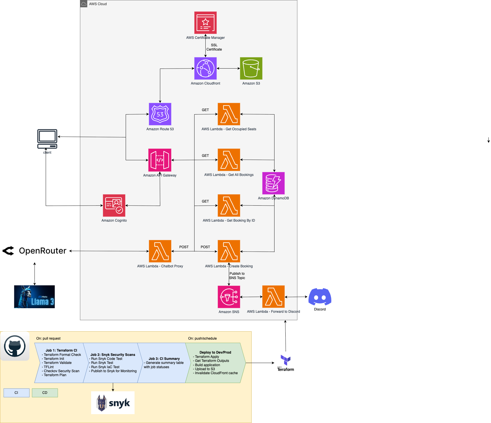
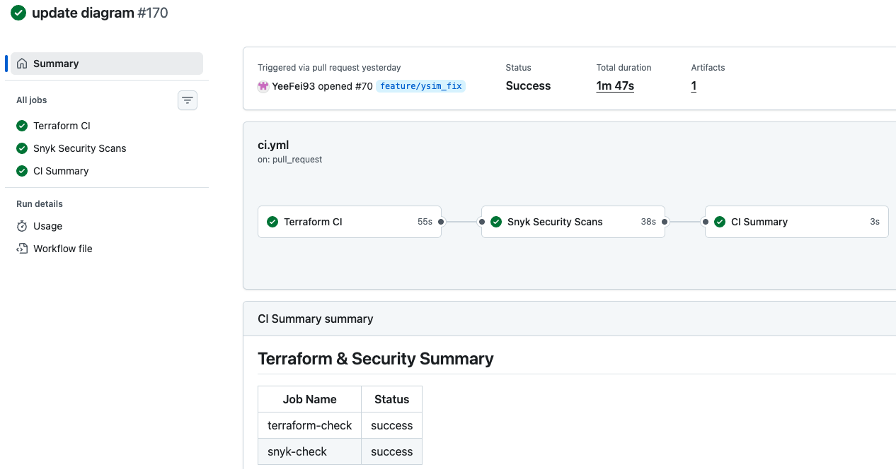
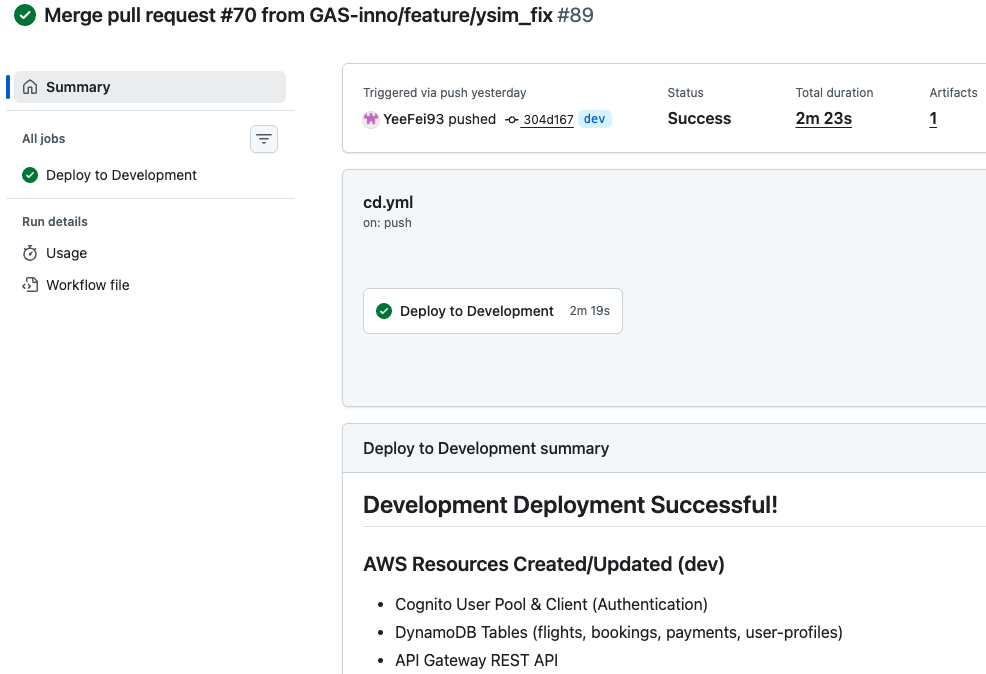

# Sky High Booker

**Flight Booking Application** - A serverless React application with AWS static website hosting.

[](https://github.com/GAS-inno/AWS-CE11-capstoneProj-group3/actions/workflows/ci.yml)
[](https://github.com/GAS-inno/AWS-CE11-capstoneProj-group3/actions/workflows/cd.yml)

## Overview

**Sky High Booker** is a startup cloud-native flight booking platform built entirely on AWS serverless architecture. A complete end-to-end flight booking experience powered by modern web technologies and AWS cloud services.

### AWS-Powered Infrastructure

Built on a fully serverless AWS architecture for scalability, reliability, and cost-efficiency:

- **AWS Cognito** - Secure user authentication and authorization with federated identity management
- **AWS Lambda** - Serverless compute for booking APIs, chatbot proxy, and notification processing
- **Amazon DynamoDB** - NoSQL database for flights, bookings, payments, and user profiles
- **Amazon API Gateway** - RESTful API management with rate limiting and request validation
- **Amazon S3 + CloudFront** - Global content delivery with edge caching for optimal performance
- **Amazon Route 53** - DNS management and domain routing
- **Amazon SNS** - Event-driven messaging for booking notifications
- **Amazon SQS** - Dead Letter Queue for failed Lambda invocations

### Real-Time Notifications

Integrated **Discord webhook** functionality ensures instant booking confirmations and updates are delivered to the team's Discord channel via SNS triggers. When a booking is created, an SNS notification automatically forwards the details to Discord, enabling real-time monitoring of booking activities.

### AI Chatbot Assistant

Intelligent chatbot integration provides:
- Booking guidance and support
- Quick answers to common questions

## Architecture



## � CI/CD Pipeline

### **Pipeline Architecture**

Our CI/CD pipeline is designed to support a **fast-growing startup team** with automated deployments from development through to production. The pipeline ensures rapid release cycles while maintaining code quality and stability as the team scales.

### **Branching Strategy**

```
feature/* → dev → main (production)
     ↓       ↓        ↓
   Local   CI+CD   CI+CD
  Testing  (Dev)   (Prod)
```

**Branch Structure:**
- **`feature/*`** - Individual feature development branches
- **`dev`** - Development environment (auto-deploy on merge)
- **`main`** - Production environment (auto-deploy on merge)

### **GitHub Actions Workflows**

#### **1. Continuous Integration (ci.yml)**

**Triggers:** Pull requests to `dev` or `main` branches

**Purpose:** Validate code quality and infrastructure before merging

```yaml
Jobs:
  ✓ Terraform Validation  # Syntax and configuration checks
  ✓ TFLint                # Terraform linting
  ✓ Checkov Security Scan # Infrastructure security analysis
  ✓ Snyk Vulnerability    # Dependency vulnerability scanning
  ✓ Code Lint & Type Check # ESLint + TypeScript validation
```

#### **2. Continuous Deployment (cd.yml)**

**Triggers:** Push to `dev` or `main` branches

**Purpose:** Automated deployment of infrastructure and application

```yaml
Deployment Flow:
  1. Terraform Plan     # Preview infrastructure changes
  2. Terraform Apply    # Deploy AWS resources
  3. npm install        # Install dependencies
  4. npm run build      # Build React application
  5. AWS S3 Sync        # Upload dist/ to S3 bucket
  6. CloudFront Invalidate # Clear CDN cache for instant updates
```

**Environment-Specific Deployments:**
- **`dev` branch** → Deploys to development environment
- **`main` branch** → Deploys to production environment

### **Complete Development Workflow**

```
1. Developer creates feature branch
   git checkout -b feature/booking-enhancement

2. Make changes and commit locally
   git add .
   git commit -m "Add seat selection validation"

3. Push to GitHub and create Pull Request to dev
   git push origin feature/booking-enhancement

4. CI Pipeline runs automatically
   ✓ Terraform validation
   ✓ Security scans
   ✓ Code quality checks
   └─ Review results in PR checks

5. Code review by team member
   - Review code changes
   - Check CI pipeline status
   - Approve or request changes

6. Merge PR to dev branch
   └─ CD Pipeline deploys to development environment
      ✓ Infrastructure updates (if any)
      ✓ Application build
      ✓ S3 upload
      ✓ CloudFront invalidation

7. Test in development environment
   - Verify functionality
   - Run integration tests
   - User acceptance testing

8. Create PR from dev → main for production release
   └─ CI Pipeline validates production deployment

9. Merge to main after approval
   └─ CD Pipeline deploys to production
      ✓ Production infrastructure
      ✓ Production application build
      ✓ Live site update
```

### **Branch Protection Rules**

To maintain code quality and prevent unauthorized changes:

**`dev` & `main` branch:**
- ✓ Require pull request reviews (1 approval minimum)
- ✓ Require status checks to pass (CI pipeline)
- ✓ Require branches to be up to date
- ✓ Include administrators in restrictions

## Security

### **Authentication**
- **AWS Cognito User Pool**: Email/password authentication with secure password policies and MFA support
- **Account Verification**: Email confirmation required for new accounts

### **Encryption**
- **At Rest**: AWS-managed encryption for DynamoDB, S3 (AES-256), Lambda environment variables, and CloudWatch Logs
- **In Transit**: TLS 1.2+ enforced across all services via CloudFront and API Gateway

### **Access Control**
- **IAM Roles**: Least privilege access for Lambda functions (scoped to specific DynamoDB tables, SQS, SNS)
- **S3 Bucket**: Private bucket with CloudFront Origin Access Identity (OAI) for secure content delivery
- **API Gateway**: AWS Shield Standard DDoS protection enabled

### **CI/CD Security**
- **Snyk**: Automated dependency vulnerability scanning
- **Checkov**: Infrastructure security analysis on every pull request
- **GitHub Secrets**: Secure storage of AWS credentials and API keys

## Monitoring & Observability

### **Logging**
- **CloudWatch Logs**: Automatic log aggregation for all Lambda functions and API Gateway
- **Log Retention**: 7-day retention policy
- **Log Groups**: Organized by Lambda function (booking APIs, chatbot proxy, Discord notifications)

### **Metrics & Performance**
- **Lambda**: Invocation count, error rates, duration, and concurrent execution tracking (AWS default metrics)
- **API Gateway**: Request count, 4xx/5xx error rates, and latency tracking (AWS default metrics)
- **DynamoDB**: PAY_PER_REQUEST billing with automatic scaling, point-in-time recovery enabled

### **Error Tracking**
- **SQS Dead Letter Queue**: Captures failed Lambda invocations after 3 retry attempts
- **AWS X-Ray**: Distributed tracing enabled for Lambda functions and API Gateway

---

**Sky High Booker** - Elevating your flight booking experience! ✈️

*Built with ❤️ by CE11 Group 3*

**Team Members:** Yee Fei, Saw, Jiaqing, Zaka Malik, Andy Hon
