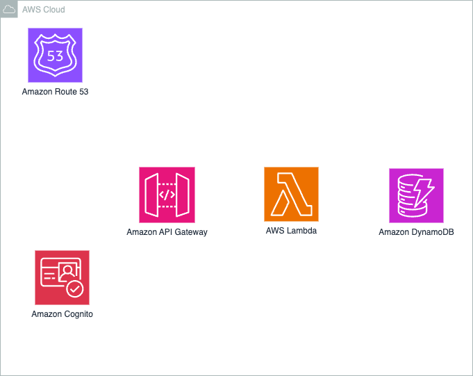

# Sky High Booker

🛫 **Modern Flight Booking Application** - A full-stack React application with AWS static website hosting.

[](https://github.com/GAS-inno/AWS-CE11-capstoneProj-group3/actions/workflows/ci.yml)
[](https://github.com/GAS-inno/AWS-CE11-capstoneProj-group3/actions/workflows/terraform.yml)
[](https://github.com/GAS-inno/AWS-CE11-capstoneProj-group3/actions/workflows/deploy.yml)

## ✨ Features

- 🔍 **Flight Search** - Search for flights by destination, dates, and preferences
- 📅 **Date Selection** - Interactive calendar for departure and return dates
- 👥 **Passenger Management** - Add multiple passengers with details
- � **Seat Selection** - Choose your preferred seats with visual seat map
- 💳 **Secure Booking** - Complete booking process with payment integration
- 📱 **Responsive Design** - Optimized for desktop and mobile devices
- 🎨 **Modern UI** - Built with shadcn/ui components and Tailwind CSS
- 🔐 **Authentication** - User registration and login with AWS Cognito
- 📊 **Dashboard** - User dashboard to manage bookings and profile

## 🏗️ Architecture



## Quick Start

### **🚨 New Repository Setup**
For first-time setup or new developers:

```bash
git clone <repository-url>
cd AWS-CE11-capstoneProj-group3

# Setup infrastructure
cd terraform
terraform init
terraform apply

# Setup frontend
cd ..
npm install
npm run dev
```

### **🔄 Existing Infrastructure**
If infrastructure already exists:

```bash
# Frontend development only
npm install
cp .env.example .env
# Edit .env with current AWS environment variables
npm run dev

# Or infrastructure changes
cd terraform
terraform apply
```

**⚠️ Important**: See `SETUP.md` for detailed dependency information.

## 📁 Project Structure

```
sky-high-booker/
├── 📁 src/                     # React application source
│   ├── 📁 components/         # Reusable UI components
│   │   ├── ui/               # shadcn/ui components
│   │   ├── booking/          # Booking-specific components
│   │   ├── flight/           # Flight search components
│   │   └── auth/             # Authentication components
│   ├── 📁 pages/             # Page components
│   ├── 📁 contexts/          # React contexts (auth, booking)
│   ├── 📁 hooks/             # Custom React hooks
│   ├── 📁 lib/               # Utility functions
│   └── 📁 assets/            # Static assets
├── 📁 terraform/             # Infrastructure as Code
│   ├── main.tf              # Core AWS resources (S3, CloudFront, VPC)
│   ├── backend.tf           # Remote state configuration
│   ├── provider.tf          # AWS provider setup
│   ├── variable.tf          # Input variables
│   └── output.tf            # Resource outputs
├── 📁 docs/                  # Documentation
│   ├── 📁 deployment/       # Deployment guides
│   ├── 📁 infrastructure/   # Architecture documentation
│   └── 📁 development/     # Development setup guides
├── 📁 .github/workflows/     # GitHub Actions CI/CD
│   ├── ci.yml               # Continuous Integration
│   ├── deploy.yml           # Automated deployment
│   ├── deploy-multi-env.yml # Multi-environment deployment
│   └── terraform.yml        # Infrastructure management
└── 📄 [config files]        # Various configuration files
```

## 🛠️ Technology Stack

### **Frontend**
- **React 18** with TypeScript
- **Vite** for fast development and building
- **Tailwind CSS** for styling
- **shadcn/ui** for UI components
- **Lucide React** for icons
- **React Router** for navigation
- **React Hook Form** for form management

### **Backend & Database**
- **AWS Lambda** (Node.js) for serverless API functions
- **Amazon DynamoDB** for NoSQL database
- **AWS Cognito** for user authentication
- **API Gateway** for REST API management

### **Infrastructure**
- **Amazon S3** for static website hosting
- **Amazon CloudFront** for CDN
- **VPC** with public/private subnets
- **Route 53** for DNS management

### **DevOps**
- **Terraform** for Infrastructure as Code
- **GitHub Actions** for CI/CD
- **AWS CLI** for deployment automation

## 🚢 Deployment

### **Automated Deployment (Recommended)**
```bash
# Push to main branch triggers automatic deployment
git push origin main

# Or manually trigger via GitHub Actions
# Go to Actions → "Complete CI/CD Pipeline" → "Run workflow"
```

### **Manual Deployment**
```bash
# Deploy infrastructure only
cd terraform/
terraform init
terraform apply

# Build frontend locally
cd ..
npm install
npm run build
# Upload `dist/` to your S3 bucket via AWS CLI or CI
```

### **Multi-Environment Support**
- **Staging**: Triggered on `develop` branch
- **Production**: Triggered on `main` branch or manual approval
- **Feature branches**: CI testing only

## 📚 Documentation

Comprehensive documentation is available in the [`docs/`](./docs/) directory:

- 📖 **[Development Setup](./docs/development/setup.md)** - Complete development environment setup
- 🏗️ **[Infrastructure Architecture](./docs/infrastructure/architecture.md)** - AWS infrastructure deep dive
- 🚀 **[Deployment Guide](./docs/deployment/guide.md)** - Comprehensive deployment instructions
 

### **Quick Links**
- [Getting Started](./docs/development/setup.md#-quick-start)
- [Environment Variables](./docs/development/setup.md#-environment-setup)
- [Deployment Process](./docs/deployment/guide.md#-automated-deployment-github-actions)
- [Troubleshooting](./docs/deployment/guide.md#-troubleshooting)
- [Architecture Overview](./docs/infrastructure/architecture.md#-architecture-overview)

## 🔧 Development

### **Available Scripts**
```bash
# Development
npm run dev              # Start development server
npm run build           # Build for production
npm run preview         # Preview production build locally

# Code Quality
npm run lint            # ESLint checking
npm run type-check      # TypeScript validation
npm test               # Run tests
npm run format         # Format with Prettier

# Deployment
cd terraform && terraform apply   # Provision infra
npm run build                      # Build frontend
# Upload `dist/` to S3 (via CI or AWS CLI)
```

### **Key Development Commands**
```bash
# Setup new development environment
npm install && npm run dev

# Run development server with hot reload
npm run dev

# Build and test locally
npm run build && npm run preview

# Type checking and linting
npm run type-check && npm run lint
```

## 🧪 Testing

```bash
# Run all tests
npm test

# Run tests in watch mode
npm run test:watch

# Run tests with coverage
npm run test:coverage

# E2E tests (if configured)
npm run test:e2e
```

## 🔒 Security

- **Authentication**: AWS Cognito with email/password
- **Authorization**: IAM policies and Cognito user pools
- **Data Protection**: HTTPS everywhere, secure headers
- **Infrastructure**: Private subnets, security groups, IAM roles
- **Secrets Management**: GitHub Secrets
  
## 📊 Monitoring

- **Application Monitoring**: CloudWatch logs for Lambda functions
- **Infrastructure Monitoring**: CloudFront, S3, and API Gateway metrics
- **Error Tracking**: CloudWatch error logs and alarms
- **Performance**: CDN cache hit rates and API response times

## 🤝 Contributing

1. **Fork the repository**
2. **Create a feature branch**: `git checkout -b feature/amazing-feature`
3. **Make your changes** and test locally
4. **Run quality checks**: `npm run lint && npm run type-check && npm test`
5. **Commit changes**: `git commit -m 'Add amazing feature'`
6. **Push to branch**: `git push origin feature/amazing-feature`
7. **Create Pull Request** with detailed description

### **Development Workflow**
- Follow TypeScript strict mode
- Use conventional commit messages
- Add tests for new features
- Update documentation as needed
- Ensure CI passes before merging

## 👥 Team

- **Development Team**: CE11 Group 3
- **Infrastructure**: AWS ECS Fargate with Terraform
- **Frontend**: React + TypeScript + Tailwind CSS
- **Backend**: AWS Lambda + DynamoDB + Cognito

## 🔗 Links

- **Live Application**: [Deployed via AWS ECS]
- **Documentation**: [`docs/`](./docs/) directory
- **GitHub Actions**: [Workflows](./.github/workflows/)
- **Infrastructure**: [`terraform/`](./terraform/) directory
- **Deployment Scripts**: [`scripts/`](./scripts/) directory

## 📞 Support

For questions, issues, or contributions:

1. **Check Documentation**: Review the [`docs/`](./docs/) directory
2. **GitHub Issues**: Create an issue for bugs or feature requests
3. **GitHub Discussions**: Ask questions and share ideas
4. **Pull Requests**: Contribute improvements and fixes

---

**Sky High Booker** - Elevating your flight booking experience! ✈️

*Built with ❤️ by CE11 Group 3*

## Available Scripts

- `npm run dev` - Start development server
- `npm run build` - Build for production
- `npm run preview` - Preview production build
- `npm run lint` - Run ESLint
- `npm run type-check` - Run TypeScript checks

## Deployment

### Frontend Deployment
The application can be deployed to various platforms:
- **AWS S3 + CloudFront** (recommended)
- **Vercel**
- **Netlify**

### Infrastructure Deployment
Use Terraform to deploy the AWS infrastructure:
```bash
cd terraform
terraform init
terraform apply
```
---

Built with ❤️ by the CE11 Group 3 Team
