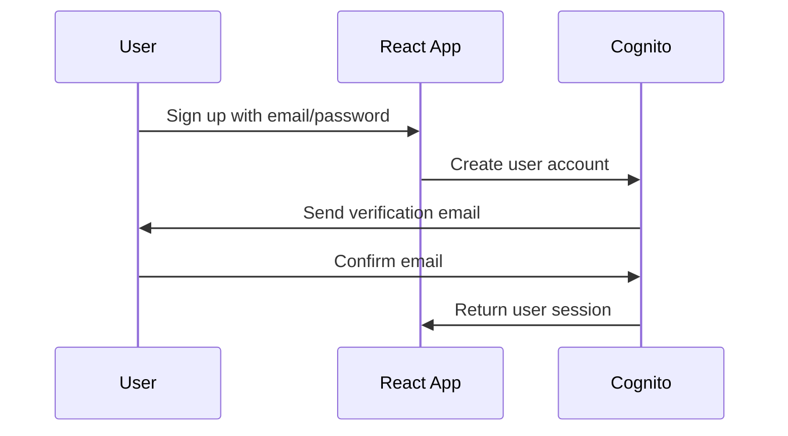
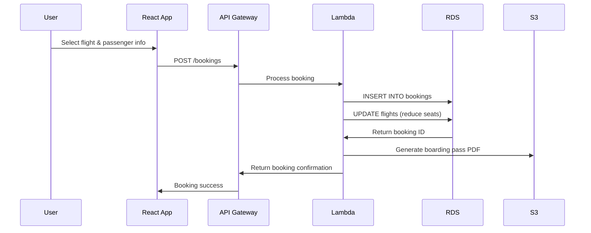
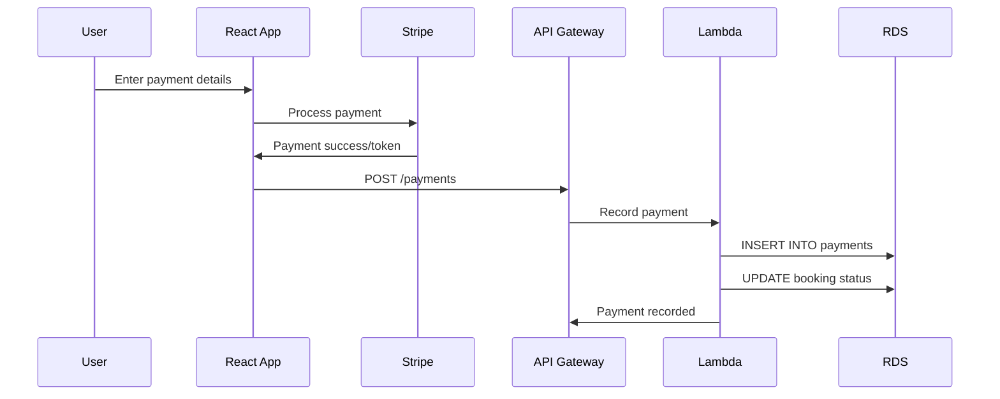

# 🗄️ **Sky High Booker Data Architecture on AWS**

## **Complete Data Flow & Storage Mapping**

### **📊 Data Storage Distribution:**

```
┌─────────────────┐    ┌──────────────────┐    ┌─────────────────┐
│   Frontend      │    │   API Gateway    │    │  AWS Services   │
│   (React App)   │────│   + Lambda       │────│   (Data Layer)  │
└─────────────────┘    └──────────────────┘    └─────────────────┘
```

---

## **1. 👤 USER DATA → Amazon Cognito**

### **User Authentication & Profile Data:**
```typescript
interface CognitoUserData {
  // Stored in Cognito User Pool
  userId: string              // Auto-generated UUID
  email: string              // Primary identifier
  emailVerified: boolean     // Email confirmation status
  firstName: string          // User's given name
  lastName: string           // User's family name
  role: 'user' | 'admin'     // Custom attribute
  createdAt: timestamp       // Account creation
  lastLogin: timestamp       // Session tracking
  
  // Authentication Data (encrypted by Cognito)
  passwordHash: string       // Securely hashed
  mfaEnabled: boolean       // Multi-factor auth
  sessionTokens: JWT[]      // Access/refresh tokens
}
```

**Storage Location:** `AWS Cognito User Pool: ce11g3-user-pool`

---

## **2. 🛫 FLIGHT DATA → Amazon RDS PostgreSQL**

### **Flights Table:**
```sql
CREATE TABLE flights (
    id UUID PRIMARY KEY DEFAULT gen_random_uuid(),
    from_location VARCHAR(100) NOT NULL,        -- "New York (JFK)"
    to_location VARCHAR(100) NOT NULL,          -- "Los Angeles (LAX)"
    departure_time TIMESTAMP NOT NULL,          -- Flight departure
    arrival_time TIMESTAMP NOT NULL,            -- Flight arrival
    price DECIMAL(10,2) NOT NULL,               -- Base ticket price
    airline VARCHAR(100) NOT NULL,              -- "American Airlines"
    flight_number VARCHAR(20) NOT NULL,         -- "AA123"
    duration VARCHAR(20) NOT NULL,              -- "5h 30m"
    aircraft VARCHAR(100) NOT NULL,             -- "Boeing 737"
    available_seats INTEGER NOT NULL,           -- Remaining capacity
    created_at TIMESTAMP DEFAULT CURRENT_TIMESTAMP,
    updated_at TIMESTAMP DEFAULT CURRENT_TIMESTAMP
);
```

**Sample Data:**
```json
{
  "id": "a1b2c3d4-e5f6-7890-abcd-ef1234567890",
  "from_location": "New York (JFK)",
  "to_location": "Los Angeles (LAX)", 
  "departure_time": "2024-12-15T08:00:00Z",
  "arrival_time": "2024-12-15T11:30:00Z",
  "price": 299.99,
  "airline": "American Airlines",
  "flight_number": "AA123",
  "duration": "5h 30m",
  "aircraft": "Boeing 737",
  "available_seats": 150
}
```

---

## **3. 🎫 BOOKING DATA → Amazon RDS PostgreSQL**

### **Bookings Table:**
```sql
CREATE TABLE bookings (
    id UUID PRIMARY KEY DEFAULT gen_random_uuid(),
    user_id VARCHAR(255) NOT NULL,              -- Cognito User ID
    flight_id UUID REFERENCES flights(id),      -- Foreign key to flights
    passenger_name VARCHAR(255) NOT NULL,       -- Full passenger name
    passenger_email VARCHAR(255) NOT NULL,      -- Contact email
    seat_number VARCHAR(10) NOT NULL,           -- "12A", "24B", etc.
    booking_status VARCHAR(20) DEFAULT 'confirmed', -- Status tracking
    total_amount DECIMAL(10,2) NOT NULL,        -- Final price paid
    booking_date TIMESTAMP DEFAULT CURRENT_TIMESTAMP,
    created_at TIMESTAMP DEFAULT CURRENT_TIMESTAMP,
    updated_at TIMESTAMP DEFAULT CURRENT_TIMESTAMP
);
```

**Sample Booking:**
```json
{
  "id": "booking-123e4567-e89b-12d3-a456-426614174000",
  "user_id": "us-east-1_abcdef123:user-uuid-from-cognito",
  "flight_id": "a1b2c3d4-e5f6-7890-abcd-ef1234567890",
  "passenger_name": "John Doe",
  "passenger_email": "john.doe@email.com",
  "seat_number": "12A",
  "booking_status": "confirmed",
  "total_amount": 349.99,
  "booking_date": "2024-11-02T14:30:00Z"
}
```

---

## **4. 💳 PAYMENT DATA → Amazon RDS PostgreSQL**

### **Payments Table:**
```sql
CREATE TABLE payments (
    id UUID PRIMARY KEY DEFAULT gen_random_uuid(),
    booking_id UUID REFERENCES bookings(id),    -- Links to booking
    user_id VARCHAR(255) NOT NULL,              -- Cognito User ID
    payment_method VARCHAR(50) NOT NULL,        -- "credit_card", "paypal"
    payment_status VARCHAR(20) DEFAULT 'pending', -- "completed", "failed"
    amount DECIMAL(10,2) NOT NULL,              -- Payment amount
    currency VARCHAR(3) DEFAULT 'USD',          -- Currency code
    transaction_id VARCHAR(255),                -- External payment ID
    payment_gateway VARCHAR(50),                -- "stripe", "paypal"
    payment_date TIMESTAMP DEFAULT CURRENT_TIMESTAMP,
    created_at TIMESTAMP DEFAULT CURRENT_TIMESTAMP
);
```

**Sample Payment:**
```json
{
  "id": "pay-123e4567-e89b-12d3-a456-426614174000",
  "booking_id": "booking-123e4567-e89b-12d3-a456-426614174000",
  "user_id": "us-east-1_abcdef123:user-uuid-from-cognito", 
  "payment_method": "credit_card",
  "payment_status": "completed",
  "amount": 349.99,
  "currency": "USD",
  "transaction_id": "txn_stripe_abc123def456",
  "payment_gateway": "stripe"
}
```

---

## **5. 📄 FILE STORAGE → Amazon S3**

### **S3 Bucket Structure:**
```
sky-high-booker-storage/
├── users/
│   ├── {user-id}/
│   │   ├── profile-picture.jpg
│   │   └── documents/
├── bookings/
│   ├── {booking-id}/
│   │   ├── boarding-pass.pdf
│   │   ├── receipt.pdf
│   │   └── confirmation.pdf
├── flights/
│   ├── aircraft-images/
│   └── route-maps/
└── static/
    ├── airline-logos/
    └── app-assets/
```

**Sample S3 Objects:**
```json
{
  "bucket": "sky-high-booker-storage",
  "objects": [
    "users/us-east-1_abc123:user-uuid/profile-picture.jpg",
    "bookings/booking-123e4567/boarding-pass.pdf", 
    "bookings/booking-123e4567/receipt.pdf",
    "flights/aircraft-images/boeing-737.jpg"
  ]
}
```

---

## **📊 Data Flow Examples**

### **User Registration Flow:**


### **Booking Creation Flow:**


### **Payment Processing Flow:**


---

## **🔒 Security & Encryption**

### **Data at Rest:**
- **RDS**: AES-256 encryption enabled
- **S3**: Server-side encryption (SSE-S3)
- **Cognito**: Built-in encryption for all user data

### **Data in Transit:**
- **HTTPS/TLS 1.3**: All API communications
- **VPC**: Database isolated in private subnets
- **IAM**: Role-based access control

### **Access Control:**
```json
{
  "cognito_users": "Can only access their own data",
  "lambda_functions": "Database access via IAM roles", 
  "api_gateway": "JWT token validation required",
  "s3_bucket": "Pre-signed URLs for file access"
}
```

---

## **📈 Scalability & Performance**

### **Read Replicas**: RDS can add read replicas for heavy read workloads
### **Connection Pooling**: Lambda uses connection pooling for database efficiency  
### **Caching**: API Gateway response caching for frequently accessed data
### **CDN**: S3 + CloudFront for fast file delivery globally

---

## **💾 Backup & Recovery**

### **RDS Automated Backups:**
- **Daily snapshots** with 7-day retention
- **Point-in-time recovery** within backup window
- **Cross-region backup replication** (optional)

### **Cognito Backup:**
- **AWS Backup service** integration
- **User export/import** capabilities

### **S3 Versioning:**
- **File versioning** enabled
- **Cross-region replication** (optional)

---

## **🎯 Summary**

**✅ All your application data is stored securely in AWS:**


1. **User accounts & auth** → Cognito User Pool
2. **Flight & booking data** → DynamoDB
3. **Payment records** → Not stored (simulated only for demo)
4. **Files & documents** → S3 bucket (if needed)
5. **Session data** → Cognito (temporary)

**✅ Benefits of AWS Native Architecture:**
- Better security isolation (VPC)
- More granular access control (IAM)
- Serverless scalability with DynamoDB
- Better integration with other AWS services
- Pay-per-use pricing model

Your data is enterprise-grade secure and ready to scale! 🚀
```